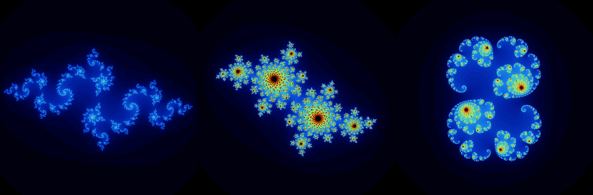
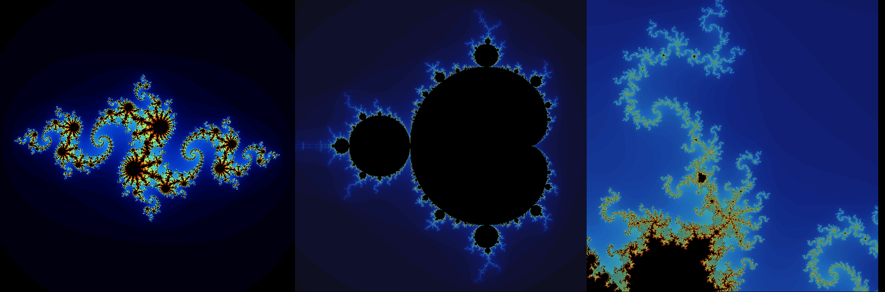

# Fractal
According to the dictionary definition, a fractal is a geometric object in which the same structure, fragmented or apparently irregular, is repeated at different scales and sizes.

The use of computers to explore these objects is both helpful and fascinating. We can zoom in almost indefinitely, entering what resembles an infinite universe, where colors and shapes make us want to keep exploring more and more.

As a mathematician I have always been attracted to fractals, and it was something I knew that sooner or later I would end up exploring for myself.

Taking advantage of the fact that I have to do a graphic project in an educational assignment I am involved in, I decided to outline some fractals.

For this project there were some restrictions: it had to be written in C and use a simple graphic library <a name="https://github.com/codam-coding-college/MLX42">MLX42</a>.
Here are some of the images obtained with the program:





## Table of contents
1. [Project](#project)
2. [Installation](#installation)
3. [Usage](#usage)

## Project <a name="project"></a>
The Goal of this project is to build a program that can draw some fractals. The chosen fractals are Julia, Mandel and Burning Ship. All of them are "time scape" fractals, this is, for every point, time of scape is computed, and then translated into a color.

## Installation <a name="installation"></a>
- Clone the repo.
```
git clone https://github.com/pingwie/fractal
```
- Compile the program.
```
make
```
- Execute the program (available fractals: julia, mandel, burning).
```
./fractal <fractal>
```
## Usage <a name="usage"></a>
You can navigate all the fractals using the arrow keys for moving, and the mouse wheel for zooming in and out.
- Mandel and Burning Ships:
The **R** key resets the fractal to its initial state (zoom and position)
- Julia:
The **R** key cicles the constant *c* used in the *Julia Set* in a set of fixed constant. The fractal is then reset.
$$z_{n+1} = z_{n} + c$$
In this fractal you can also use the **ADWS** keys to slowly adjust the constant *c* value.
